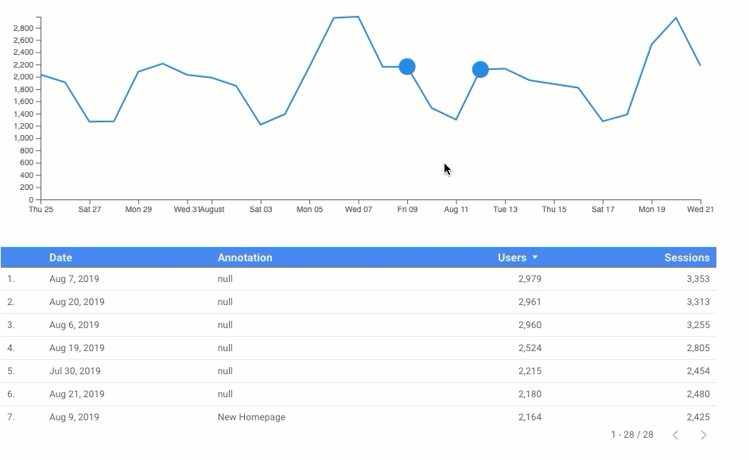
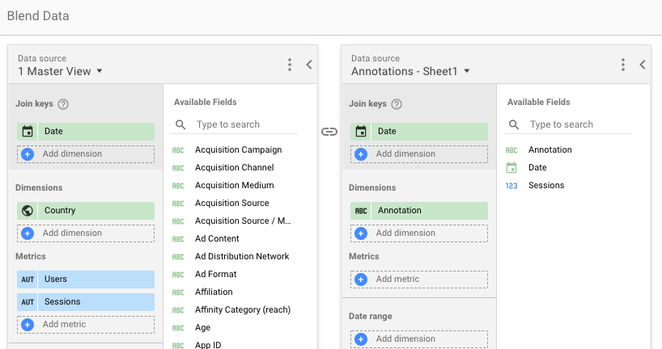

## Time Series chart with annotations for Data Studio

I wrote this community visualization because I wanted to be able to see **annotations** directly on time series charts.

It uses D3 and the wonderful [d3-annotation package](https://github.com/susielu/d3-annotation). It also uses the [dscc](https://github.com/googledatastudio/dscc-gen) package for tooling and the various examples at the [community viz repo](https://github.com/googledatastudio/community-visualizations) got me started.

The visualization includes various ways to style the chart and also supports **filters** when you click on an annotation.



## Setup

In order to associate annotations with the chart you'll want to have a data source that has a date, metric and annotation column, for example this [sheet](https://docs.google.com/spreadsheets/d/1_J7P3OmXxWmQ5xYE_ZMYxdATy-pq6MAn-IqGJBMQOjg/edit?usp=sharing).

The real power is when you blend your annotations data source with another source, eg Google Analytics. All you have to do is use **Date** as the join key.



## Published version

The published version of this visualization is deployed at:

```
gs://analytics_buddy_viz/timeseries
```

An example of the visualization can be [seen here](https://datastudio.google.com/open/124mJorivpYxTj_ahobBZE-6R07AmnyUg).

## Author

This code was written by Michael Whitaker.